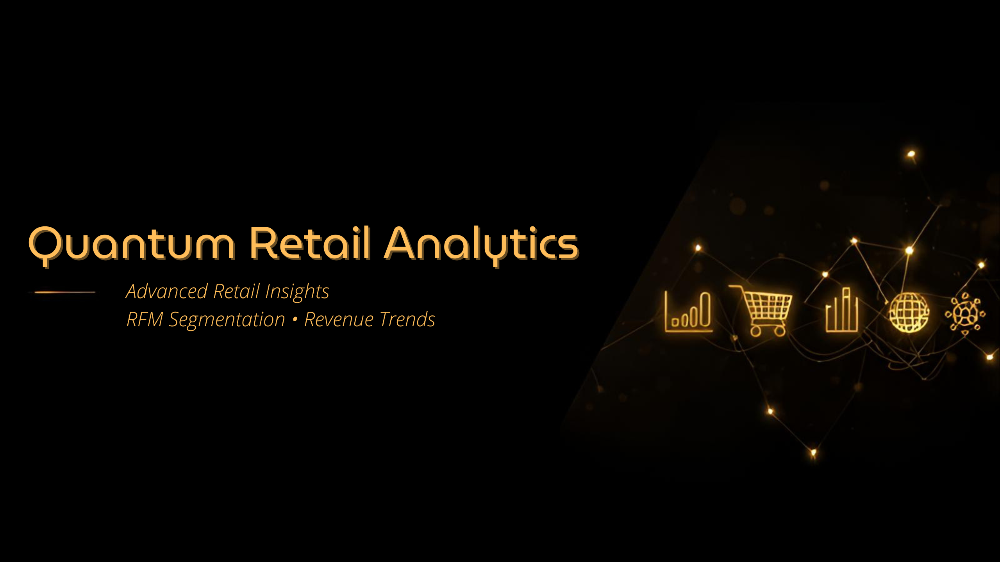

# 🛍️ Quantium Retail Analytics (R Project)



This project performs retail data analysis using the **Online Retail Excel dataset**.  
It includes cleaning, sales insights, segmentation, clustering, and visualizations.

---

## 🔍 Overview
This project includes:
- Data cleaning & preprocessing  
- Monthly revenue trend  
- Top products  
- Top customers  
- RFM segmentation  
- Customer clustering (K-Means)  
- Product clustering  
- Visualizations  
- Exported result tables  

---

## 📈 Key Insights

### Monthly Revenue Trend
Shows how revenue changes month by month.

### Top Products
The most sold and highest revenue products.

### Top Customers
Customers who spent the most and purchased the most.

### RFM Segmentation
Uses Recency, Frequency, and Monetary value to classify customers.

### Product Clustering
Groups products by quantity sold and revenue generated.

---

## 📁 Project Structure

```
quantium-retail-analytics/
│── data/
│   └── Online Retail.xlsx
│
│── scripts/
│   └── analysis.R
│
│── outputs/
│   ├── plots/
│   └── tables/
│
│── banner.png
│── README.md
```

---

## 🛠 Tech Stack
- R  
- Tidyverse  
- Lubridate  
- ggplot2  
- Data.Table  
- Factoextra (clustering)  

---

## ▶️ How to Run

1. Install required R packages:
```r
install.packages(c(
 "tidyverse","readxl","lubridate","janitor",
 "skimr","scales","cluster","factoextra",
 "data.table","ggplot2"
))
```

2. Place your Excel file here:
```
data/Online Retail.xlsx
```

3. Run the script:
```
scripts/analysis.R
```

Outputs will appear in:
```
outputs/tables/
outputs/plots/
```

---

## 👤 Author
**Bhavya Pandya**
